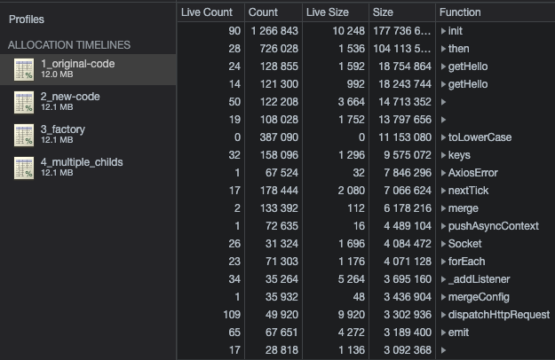

### Setup
The tests described bellow were executed using [bombardier](https://github.com/codesenberg/bombardier) (a HTTP load generating tool). Other alternatives could be:
- [autocannon](https://github.com/mcollina/autocannon)
- [vegeta](https://github.com/tsenart/vegeta)
- [Apache ab](https://httpd.apache.org/docs/2.4/programs/ab.html)

Also, the tests expect a local HTTP server to be running at `http://localhost:3030/hello`, which should return any arbitrary JSON payload (this was done just to simulate better what happens in production). Here's a simple [mock api server implementation](https://github.com/rafael-piovesan/node-mock-server) that could be used.

### Scenario 01: original code
Replicates the original scenario which has led to the CPU issue in production.

```log
bombardier -c 10 -d 5m -t 5s --http1 http://localhost:3000/1
Bombarding http://localhost:3000/1 for 5m0s using 10 connection(s)
[===========================================================================================================================================================] 5m0s
Done!
Statistics        Avg      Stdev        Max
  Reqs/sec         3.99      23.47     211.41
  Latency         2.50s    53.87ms      2.76s
  HTTP codes:
    1xx - 0, 2xx - 1200, 3xx - 0, 4xx - 0, 5xx - 0
    others - 0
  Throughput:     1.38KB/s
```



### Scenario 02: new code
Applies the same solution that has fixed the CPU problem in production.

```log
bombardier -c 10 -d 5m -t 5s --http1 http://localhost:3000/2
Bombarding http://localhost:3000/2 for 5m0s using 10 connection(s)
[===========================================================================================================================================================] 5m0s
Done!
Statistics        Avg      Stdev        Max
  Reqs/sec         4.05      23.35     211.41
  Latency         2.46s    41.48ms      2.57s
  HTTP codes:
    1xx - 0, 2xx - 1221, 3xx - 0, 4xx - 0, 5xx - 0
    others - 0
  Throughput:     1.40KB/s
```


### Scenario 03: refactoring to use a factory
First variation of the fix to test the hypothesis where the problem might be related to fact the we're creating multiple instances of a Class marked with the `@injectable()` decorator.

```log
bombardier -c 10 -d 5m -t 5s --http1 http://localhost:3000/3
Bombarding http://localhost:3000/3 for 5m0s using 10 connection(s)
[===========================================================================================================================================================] 5m0s
Done!
Statistics        Avg      Stdev        Max
  Reqs/sec         4.05      23.87     256.95
  Latency         2.46s    29.10ms      2.55s
  HTTP codes:
    1xx - 0, 2xx - 1220, 3xx - 0, 4xx - 0, 5xx - 0
    others - 0
  Throughput:     1.40KB/s
```


### Scenario 04: refactoring to avoid spawning multiple child objects
Second variation of the fix to test the hypothesis where the problem might be related to fact the we're creating multiple instances of `ApiService` class while passing along references to the same original object.


```log
bombardier -c 10 -d 5m -t 5s --http1 http://localhost:3000/4
Bombarding http://localhost:3000/2 for 5m0s using 10 connection(s)
[===========================================================================================================================================================] 5m0s
Done!
Statistics        Avg      Stdev        Max
  Reqs/sec         4.05      23.35     211.41
  Latency         2.46s    41.48ms      2.57s
  HTTP codes:
    1xx - 0, 2xx - 1221, 3xx - 0, 4xx - 0, 5xx - 0
    others - 0
  Throughput:     1.40KB/s
```

